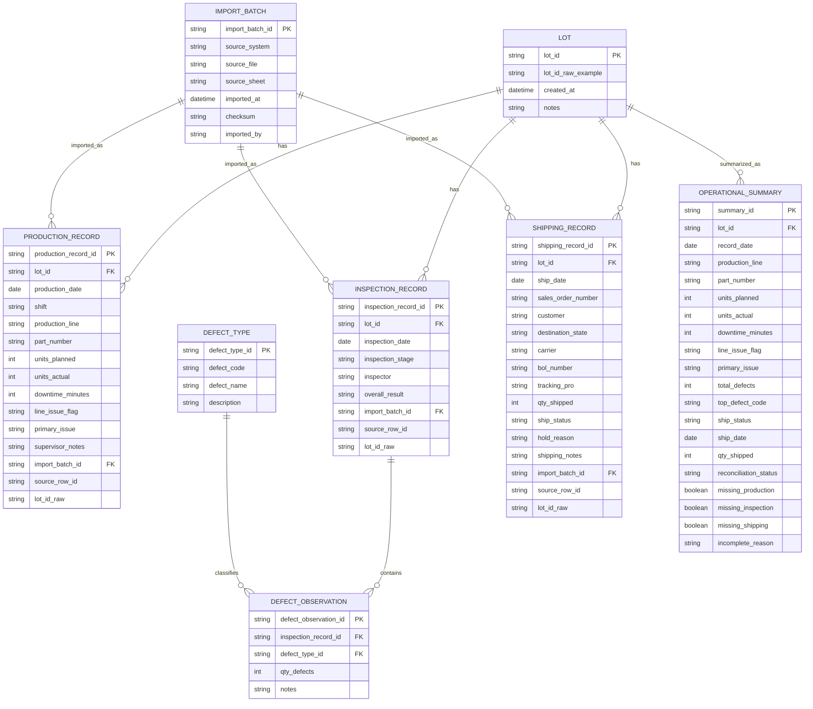

# Data Design: Unified Operational Summary (Production + Inspection + Shipping)

This document defines the **data entities, attributes, and relationships** required to support a unified operational summary that aligns **production**, **quality inspection**, and **shipping** records by **Lot ID** and **Date**, with drill‑down traceability back to source spreadsheets.

The design is derived from the **operations user story + acceptance criteria**, and validated against the two uploaded spreadsheets:
- **Ops_Production_Log.xlsx** (sheet: `Production Log`)
- **Ops_Shipping_Log.xlsx** (sheet: `Shipping Log`)

---

## 1) Source Spreadsheets (Observed Columns)

### Production Log (`Ops_Production_Log.xlsx`)
Columns:
- `Date`
- `Shift`
- `Production Line`
- `Lot ID`
- `Part Number`
- `Units Planned`
- `Units Actual`
- `Downtime (min)`
- `Line Issue?`
- `Primary Issue`
- `Supervisor Notes`

### Shipping Log (`Ops_Shipping_Log.xlsx`)
Columns:
- `Ship Date`
- `Lot ID`
- `Sales Order #`
- `Customer`
- `Destination (State)`
- `Carrier`
- `BOL #`
- `Tracking / PRO`
- `Qty Shipped`
- `Ship Status`
- `Hold Reason`
- `Shipping Notes`

---

## 2) Key Assumptions & Data Quality Rules

### Alignment keys
- Primary alignment is **`lot_id` + `record_date`** (AC1).
- Where dates represent different concepts (production day vs ship day), the system stores both:
  - `production_date` on ProductionRecord
  - `ship_date` on ShippingRecord
  - `record_date` on the OperationalSummary is the **lot‑centric timeline date** used by the UI (typically production date; the summary also carries ship_date when present).

### Canonical Lot ID (important!)
The spreadsheets contain inconsistent lot formats (examples observed):  
- `Lot-20251221-002`, `LOT 20260112 001`, and occasional typos like `L0T ...` (zero instead of “O”).

**Rule:** store the raw lot string and also store a **canonical lot id** used for joins.
- `lot_id_raw`: original string from the sheet  
- `lot_id`: canonical form for matching (e.g., `20260112001`)  

Normalization should:
- uppercase
- remove non‑alphanumerics
- fix common OCR/typing issues (e.g., `L0T` → `LOT`)
- strip leading `LOT`

### Missing data behavior
- If a lot/date exists in one source but not the others, the summary row still appears and flags missing sources (AC2).
- If `Lot ID` or `Date` is missing/invalid in a record:
  - exclude it from the main summary
  - count it under **Incomplete records** (AC3)
- If reconciliation cannot be completed due to partial information, show **Insufficient data** with a reason (AC4).

---

## 3) Two AI Extractions (Comparison) and Merge

### AI #1 (Normalization + Traceability)
**What it did well**
- Cleanly normalized “defects” into a separate table (supports multiple defect types per inspection).
- Included import/audit tables so every summary number can be traced back to an exact spreadsheet row.

**Where it was weaker**
- Less explicit about operational status flags (missing source vs insufficient data) for the UI.

### AI #2 (Operational Summary + Status Modeling)
**What it did well**
- Focused on the UI’s needs: filtering, prioritization, and explicit completeness flags.
- Recommended a materialized summary table/view for fast weekly reporting.

**Where it was weaker**
- Slightly less normalized; tended to embed defect fields directly in summary.

### Final merge
We combine AI #1’s **auditability + normalized defects** with AI #2’s **status/completeness + summary performance**.

---

## 4) Final Entities and Attributes

### 4.1 Lot
Represents a lot referenced across domains.

**Attributes**
- `lot_id` (PK): canonical lot identifier used for joins
- `lot_id_raw_example` (optional, derived): sample of raw formatting for debugging
- `created_at` (optional)
- `notes` (optional)

---

### 4.2 ImportBatch
Tracks each spreadsheet import for reproducibility and drill‑down.

**Attributes**
- `import_batch_id` (PK)
- `source_system` (ENUM: `production`, `inspection`, `shipping`)
- `source_file` (e.g., `Ops_Production_Log.xlsx`)
- `source_sheet` (e.g., `Production Log`)
- `imported_at`
- `checksum` (optional)
- `imported_by` (optional)

---

### 4.3 ProductionRecord  *(mapped directly to Production Log rows)*
**Attributes (from sheet)**
- `production_record_id` (PK)
- `lot_id` (FK → Lot)
- `production_date` (from `Date`)
- `shift` (from `Shift`)
- `production_line` (from `Production Line`)
- `part_number` (from `Part Number`)
- `units_planned` (from `Units Planned`)
- `units_actual` (from `Units Actual`)
- `downtime_minutes` (from `Downtime (min)`)
- `line_issue_flag` (from `Line Issue?`)
- `primary_issue` (from `Primary Issue`)
- `supervisor_notes` (from `Supervisor Notes`)

**Traceability**
- `import_batch_id` (FK → ImportBatch)
- `source_row_id` (row number or stable row key)
- `lot_id_raw` (original Lot ID string)

---

### 4.4 ShippingRecord  *(mapped directly to Shipping Log rows)*
**Attributes (from sheet)**
- `shipping_record_id` (PK)
- `lot_id` (FK → Lot)
- `ship_date` (from `Ship Date`)
- `sales_order_number` (from `Sales Order #`)
- `customer` (from `Customer`)
- `destination_state` (from `Destination (State)`)
- `carrier` (from `Carrier`)
- `bol_number` (from `BOL #`)
- `tracking_pro` (from `Tracking / PRO`)
- `qty_shipped` (from `Qty Shipped`)
- `ship_status` (from `Ship Status`)
- `hold_reason` (from `Hold Reason`)
- `shipping_notes` (from `Shipping Notes`)

**Traceability**
- `import_batch_id` (FK → ImportBatch)
- `source_row_id`
- `lot_id_raw`

---

### 4.5 InspectionRecord *(quality inspection sheet not yet uploaded)*
Represents an inspection event for a lot/date.

**Attributes**
- `inspection_record_id` (PK)
- `lot_id` (FK → Lot)
- `inspection_date`
- `inspection_stage` (optional)
- `inspector` (optional)
- `overall_result` (optional)

**Traceability**
- `import_batch_id` (FK → ImportBatch)
- `source_row_id`
- `lot_id_raw`

---

### 4.6 DefectType
Reference table of defect codes/types.

**Attributes**
- `defect_type_id` (PK)
- `defect_code` (UNIQUE)
- `defect_name` (optional)
- `description` (optional)

---

### 4.7 DefectObservation
Supports multiple defect types/quantities per inspection record.

**Attributes**
- `defect_observation_id` (PK)
- `inspection_record_id` (FK → InspectionRecord)
- `defect_type_id` (FK → DefectType)
- `qty_defects` (INT)
- `notes` (optional)

**Rule**
- Records where `qty_defects = 0` should be excluded from “defects list” UI views.

---

### 4.8 OperationalSummary  *(materialized table or view)*
This is what powers the “single summary” UI view.

**Recommended key**
- UNIQUE(`lot_id`, `record_date`)

**Attributes**
- `summary_id` (PK) *(or composite key)*
- `lot_id` (FK → Lot)
- `record_date` (DATE): primary timeline date for summary rows (typically production date)
- `production_line` (nullable)
- `part_number` (nullable)
- `units_planned` (nullable)
- `units_actual` (nullable)
- `downtime_minutes` (nullable)
- `line_issue_flag` (nullable)
- `primary_issue` (nullable)
- `total_defects` (nullable; derived from DefectObservation)
- `top_defect_code` (nullable; derived)
- `ship_status` (ENUM: shipped / not_shipped / unknown)
- `ship_date` (nullable)
- `qty_shipped` (nullable)

**Completeness / Reconciliation**
- `reconciliation_status` (ENUM: `reconciled`, `missing_sources`, `insufficient_data`)
- `missing_production` (BOOL)
- `missing_inspection` (BOOL)
- `missing_shipping` (BOOL)
- `incomplete_reason` (TEXT, nullable)

---

## 5) Relationships

- **Lot** 1 → * **ProductionRecord**
- **Lot** 1 → * **InspectionRecord**
- **InspectionRecord** 1 → * **DefectObservation**
- **DefectType** 1 → * **DefectObservation**
- **Lot** 1 → * **ShippingRecord**
- **ImportBatch** 1 → * {ProductionRecord, InspectionRecord, ShippingRecord}
- **Lot** 1 → * **OperationalSummary** (enforce uniqueness on lot_id + record_date)

---

## 6) Mermaid ERD (mermaid.js)

---

## 7) Column-to-Entity Mapping (Concrete)

### Production Log → ProductionRecord
- `Date` → `production_date`
- `Shift` → `shift`
- `Production Line` → `production_line`
- `Lot ID` → `lot_id_raw` + normalized → `lot_id`
- `Part Number` → `part_number`
- `Units Planned` → `units_planned`
- `Units Actual` → `units_actual`
- `Downtime (min)` → `downtime_minutes`
- `Line Issue?` → `line_issue_flag`
- `Primary Issue` → `primary_issue`
- `Supervisor Notes` → `supervisor_notes`

### Shipping Log → ShippingRecord
- `Ship Date` → `ship_date`
- `Lot ID` → `lot_id_raw` + normalized → `lot_id`
- `Sales Order #` → `sales_order_number`
- `Customer` → `customer`
- `Destination (State)` → `destination_state`
- `Carrier` → `carrier`
- `BOL #` → `bol_number`
- `Tracking / PRO` → `tracking_pro`
- `Qty Shipped` → `qty_shipped`
- `Ship Status` → `ship_status`
- `Hold Reason` → `hold_reason`
- `Shipping Notes` → `shipping_notes`

---

## 8) Open Items / Next Inputs
- A quality inspection spreadsheet is not yet provided. Once available, we will:
  - finalize `InspectionRecord` + `DefectObservation` mappings
  - confirm defect code fields and quantities
  - validate “recurring defects” logic inputs (multi‑lot, multi‑week).
